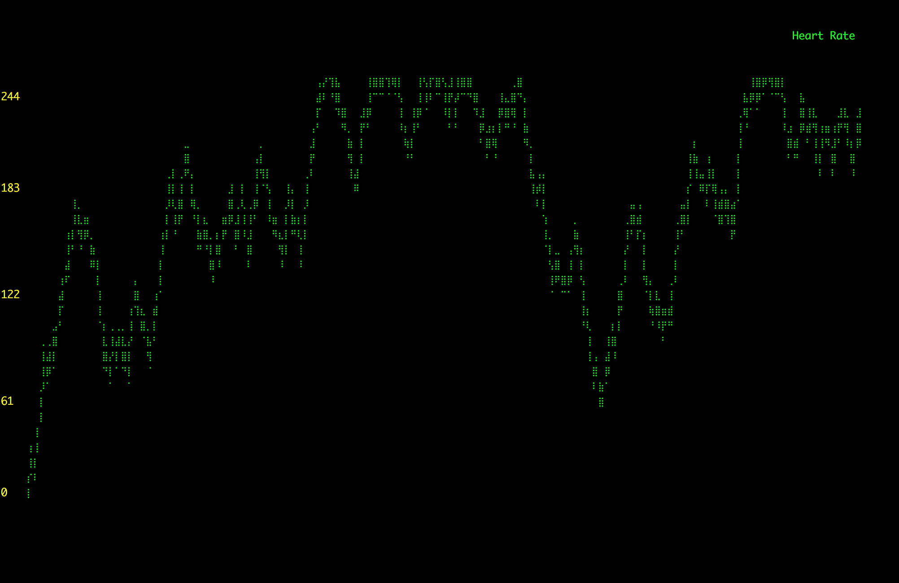

# KernelTLV Live Coding Session #1 Demo
Code for Live Coding Session 1.

Hi! This session is dedication to creating a driver and monitor application for an imaginary heart rate monitor device.
When built and run, the final result looks approximately like this:



To start using, first we create a virtual machine for this project:

1. Clone this repository using git.
1. Install [Vagrant](https://www.vagrantup.com/).
1. Install [VirtualBox](https://www.virtualbox.org/wiki/Downloads) (or your favorite [supported](https://www.vagrantup.com/docs/providers/) VM provider).
1. If using VirtualBox, install the vagrant-vbguest plugin (`vagrant plugin install vagrant-vbguest`).
1. Run `vagrant up` where you cloned the repo (where `Vagrantfile` is) to create a shiny new VM with everything you need in it.


Now you can use your favorite editor to edit project files and changes will be reflected inside the VM in the `project` directory.

To build the kernel module, run `vagrant ssh` to open a shell to the VM. Once connected, run:
```bash
make -C /lib/modules/`uname -r`/build M=$PWD
```
in the `project` directory.

To clean up the built files, run:
```bash
make -C /lib/modules/`uname -r`/build M=$PWD clean
```

Experiment and have fun,

KernelTLV Team